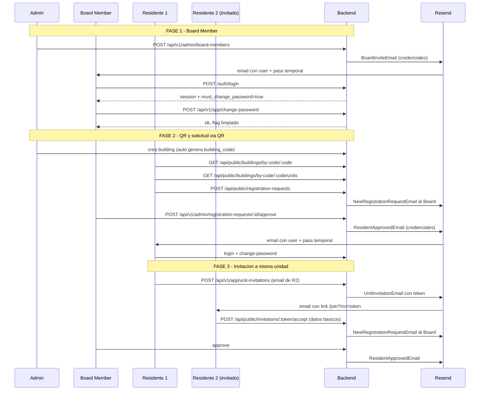
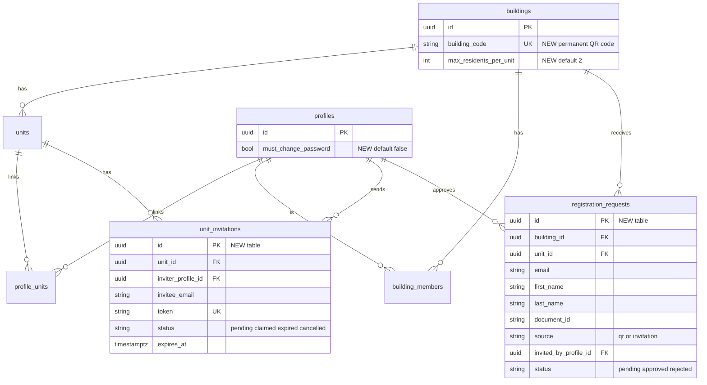

## Flujo end-to-end



## Arquitectura de datos



## 1. Migraciones SQL

Crear 3 nuevas migraciones en [supabase/migrations](supabase/migrations):

### 1a. `20260424100000_add_building_code_and_max_residents.sql`
- `ALTER TABLE buildings ADD COLUMN building_code TEXT UNIQUE` (NOT NULL tras backfill).
- `ALTER TABLE buildings ADD COLUMN max_residents_per_unit INT NOT NULL DEFAULT 2`.
- Backfill: función SQL `generate_building_code()` que devuelve `'COND-' || upper(substring(md5(random()::text) from 1 for 8))` y update a filas existentes.
- Policy SELECT pública para `buildings` limitada a `id, name, address, building_code` (para el lookup por código sin exponer settings).

### 1b. `20260424101000_add_must_change_password_to_profiles.sql`
- `ALTER TABLE profiles ADD COLUMN must_change_password BOOLEAN NOT NULL DEFAULT false`.
- Ninguna policy RLS cambia (propietario ya puede leerlo).

### 1c. `20260424102000_create_registration_flow_tables.sql`
Dos tablas + RLS:

**`registration_requests`**
```sql
CREATE TABLE registration_requests (
  id UUID PRIMARY KEY DEFAULT gen_random_uuid(),
  building_id UUID NOT NULL REFERENCES buildings(id) ON DELETE CASCADE,
  unit_id UUID NOT NULL REFERENCES units(id) ON DELETE CASCADE,
  email TEXT NOT NULL,
  first_name TEXT NOT NULL,
  last_name TEXT NOT NULL,
  document_id TEXT NOT NULL,
  phone TEXT,
  source TEXT NOT NULL CHECK (source IN ('qr','invitation')),
  invited_by_profile_id UUID REFERENCES profiles(id),
  invitation_id UUID,
  status TEXT NOT NULL DEFAULT 'pending'
    CHECK (status IN ('pending','approved','rejected')),
  created_profile_id UUID REFERENCES profiles(id),
  reviewed_by_profile_id UUID REFERENCES profiles(id),
  reviewed_at TIMESTAMPTZ,
  rejection_reason TEXT,
  created_at TIMESTAMPTZ NOT NULL DEFAULT now()
);
CREATE UNIQUE INDEX registration_requests_pending_email_uq
  ON registration_requests(building_id, email)
  WHERE status = 'pending';
```
Policies: insert público (form via QR); select/update restringido a admin o board del `building_id`.

**`unit_invitations`**
```sql
CREATE TABLE unit_invitations (
  id UUID PRIMARY KEY DEFAULT gen_random_uuid(),
  unit_id UUID NOT NULL REFERENCES units(id) ON DELETE CASCADE,
  building_id UUID NOT NULL REFERENCES buildings(id) ON DELETE CASCADE,
  inviter_profile_id UUID NOT NULL REFERENCES profiles(id),
  invitee_email TEXT NOT NULL,
  invitee_name TEXT,
  token TEXT UNIQUE NOT NULL,
  status TEXT NOT NULL DEFAULT 'pending'
    CHECK (status IN ('pending','claimed','expired','cancelled')),
  expires_at TIMESTAMPTZ NOT NULL DEFAULT (now() + interval '7 days'),
  claimed_at TIMESTAMPTZ,
  created_at TIMESTAMPTZ NOT NULL DEFAULT now()
);
```
Policies: el inviter ve sus invitaciones; el Board del `building_id` ve todas; el lookup público por token se hace vía service_role (backend).

## 2. Buildings: QR y settings

### 2a. Entity — [src/modules/buildings/domain/entities/Building.ts](src/modules/buildings/domain/entities/Building.ts)
Añadir `building_code: string` y `max_residents_per_unit: number`.

### 2b. Use case — `src/modules/buildings/application/use-cases/GetBuildingByCode.ts` (nuevo)
Retorna edificio + `units` (lista pública) dado un `building_code`. Si no existe, 404.

### 2c. Rutas públicas — [src/modules/buildings/presentation/routes.ts](src/modules/buildings/presentation/routes.ts)
Agregar bajo `buildingPublicRoutes`:
- `GET /api/public/buildings/by-code/:code` → `{ id, name, address, building_code, max_residents_per_unit }`.
- `GET /api/public/buildings/by-code/:code/units` → lista `{ id, name, floor }`.

### 2d. Generación automática
Al crear edificio (use case `CreateBuilding`), generar `building_code` usando `crypto.randomBytes(4).toString('hex').toUpperCase()` prefijado con `COND-`. Retry si hay colisión.

## 3. Security utilities — `src/core/security/password-generator.ts` (nuevo)

Helper que genera password seguro con `crypto.randomBytes` (12 chars: mayúsculas, minúsculas, dígitos, y 2 símbolos garantizados). Exporta `generateTempPassword(): string`.

## 4. Auth: must_change_password

### 4a. Entity User — [src/modules/users/domain/entities/User.ts](src/modules/users/domain/entities/User.ts)
Añadir `must_change_password: boolean`. Método `clearPasswordChangeFlag()` que lo pone en `false`.

### 4b. `LoginUser` — [src/modules/auth/domain/use-cases/login-user.ts](src/modules/auth/domain/use-cases/login-user.ts)
En la respuesta incluir `must_change_password: boolean`. No bloquear login; el frontend rutea a pantalla de cambio.

### 4c. Nuevo use case — `src/modules/auth/domain/use-cases/ChangePasswordFirstLogin.ts`
- Recibe `{ userId, newPassword }`.
- Valida política mínima (≥ 8 chars, 1 número, 1 mayúscula).
- `authRepo.changePassword(userId, newPassword)`.
- `userRepo.clearPasswordChangeFlag(userId)`.

### 4d. Guard opcional — [src/core/presentation/guards.ts](src/core/presentation/guards.ts)
Añadir `requireFreshPassword()` que se usa en rutas autenticadas sensibles: si `profile.must_change_password === true` devuelve 403 `code: 'MUST_CHANGE_PASSWORD'`. Se aplica a `appRoutes` y `adminRoutes` pero NO al endpoint de cambio de password ni a `/users/me`.

### 4e. Endpoint — nueva ruta en [src/modules/auth/presentation/routes.ts](src/modules/auth/presentation/routes.ts)
`POST /auth/change-password-first-login` (autenticado, sin `requireFreshPassword`). Body: `{ newPassword }`. Usa el profile del token.

## 5. Board Member registration

### 5a. Use case — `src/modules/users/application/use-cases/CreateBoardMember.ts` (nuevo)
Orquesta:
1. Valida caller es `ADMIN`.
2. Valida edificio existe.
3. `password = generateTempPassword()`.
4. `authRepo.createUser(email, password)` (admin API, `email_confirm: true`).
5. Crea profile: `app_role='user'`, `status='active'`, `must_change_password=true`.
6. Insert en `building_members` con `role='board'`.
7. Renderiza `BoardInviteEmail` con `{ name, email, temporaryPassword, buildingName, loginUrl }` y envía vía `emailService`.

### 5b. Endpoint — [src/modules/users/presentation/routes.ts](src/modules/users/presentation/routes.ts)
`POST /api/v1/admin/board-members` (admin-only explícito, guard inline `profile.app_role === 'admin'`). Body: `{ name, email, phone?, buildingId }`.

## 6. Registration requests (QR flow)

### 6a. Domain — `src/modules/onboarding/` (módulo nuevo)
Estructura hexagonal completa:
- `domain/entities/RegistrationRequest.ts`
- `domain/entities/UnitInvitation.ts`
- `domain/repository.ts` (interfaces `IRegistrationRequestRepository`, `IUnitInvitationRepository`)
- `application/use-cases/SubmitRegistrationRequest.ts`
- `application/use-cases/ApproveRegistrationRequest.ts`
- `application/use-cases/RejectRegistrationRequest.ts`
- `application/use-cases/ListPendingRegistrationRequests.ts`
- `application/use-cases/CreateUnitInvitation.ts`
- `application/use-cases/AcceptUnitInvitation.ts`
- `infrastructure/repositories/Supabase*Repository.ts`
- `presentation/public-routes.ts` y `presentation/admin-routes.ts` y `presentation/app-routes.ts`

### 6b. `SubmitRegistrationRequest` (público, origen QR)
Body: `{ buildingCode, unitId, email, firstName, lastName, documentId, phone? }`.
1. Busca edificio por `building_code`; valida unit pertenece al edificio.
2. Cuenta `profile_units` activos de esa unit + `registration_requests` pending de esa unit. Si `>= max_residents_per_unit` → 409.
3. Valida email no tiene ya una request pending para ese edificio (UNIQUE parcial lo garantiza, pero chequear antes para mejor error).
4. Insert en `registration_requests` con `source='qr'`.
5. Busca Board Members del edificio (query a `building_members` + `profiles`).
6. Para cada uno: renderiza `NewRegistrationRequestEmail` y envía.

### 6c. `ApproveRegistrationRequest` (board o admin del building)
1. Carga request; valida `status='pending'`.
2. Re-verifica capacidad de la unidad.
3. `password = generateTempPassword()`.
4. `authRepo.createUser(email, password)`.
5. Crea profile `status='active'`, `must_change_password=true`.
6. Insert en `profile_units` con `building_role='resident'`, `is_primary=true` si es el primer residente de la unit.
7. Update request: `status='approved'`, `reviewed_by_profile_id`, `reviewed_at`, `created_profile_id`.
8. Envía `ResidentApprovedEmail` con credenciales.

### 6d. `RejectRegistrationRequest`
Update request `status='rejected'` + motivo + envía `RegistrationRejectedEmail` (opcional).

### 6e. Endpoints
- `POST /api/public/registration-requests` (público)
- `GET /api/v1/admin/registration-requests?status=pending&buildingId=...` (listar)
- `POST /api/v1/admin/registration-requests/:id/approve`
- `POST /api/v1/admin/registration-requests/:id/reject` (body `{ reason }`)

## 7. Unit invitations (residente a residente)

### 7a. `CreateUnitInvitation` (residente activo)
Body: `{ inviteeEmail, inviteeName? }`.
1. Carga `profile_units` del caller, toma `is_primary=true` (o la primera activa).
2. Valida capacidad: activos + pending requests + pending invitations < `max_residents_per_unit`.
3. Genera `token = crypto.randomBytes(24).toString('base64url')`.
4. Insert en `unit_invitations` con `expires_at = now() + 7d`.
5. Envía `UnitInvitationEmail` con `{ inviterName, unitName, buildingName, acceptUrl }` donde `acceptUrl = <FRONT_URL>/join?inv=<token>`.

### 7b. `AcceptUnitInvitation` (público, usa token)
Body: `{ token, firstName, lastName, documentId, phone? }`.
1. Carga invitation por `token`; valida `status='pending'` y `expires_at > now()`.
2. Crea `registration_request` con `source='invitation'`, `invited_by_profile_id`, `invitation_id`, `unit_id` de la invitation, email de la invitation.
3. Update invitation: `status='claimed'`, `claimed_at=now()`.
4. Notifica al Board igual que en 6b.

### 7c. Endpoints
- `POST /api/v1/app/unit-invitations` (residente)
- `GET /api/v1/app/unit-invitations` (listar mías)
- `DELETE /api/v1/app/unit-invitations/:id` (cancelar)
- `GET /api/public/invitations/:token` (metadata: nombre del invitador, edificio, unidad)
- `POST /api/public/invitations/:token/accept`

## 8. Plantillas React Email

En [src/infrastructure/email/templates/](src/infrastructure/email/templates/):
- `BoardInviteEmail.tsx` — bienvenida board + credenciales + advertencia de cambio de contraseña.
- `NewRegistrationRequestEmail.tsx` — al Board con datos del solicitante + link al panel admin.
- `ResidentApprovedEmail.tsx` — al residente con credenciales + advertencia de cambio.
- `UnitInvitationEmail.tsx` — al invitado con CTA al accept URL.
- `RegistrationRejectedEmail.tsx` — al residente con motivo (opcional).

Todas usan el mismo layout base (componente `EmailLayout.tsx` compartido para header/footer con marca Condominio).

## 9. Configuración nueva — [src/core/config.ts](src/core/config.ts)

Añadir:
```typescript
static readonly APP_WEB_URL = process.env.APP_WEB_URL || 'https://app.nibs-tech.com';
static readonly INVITATION_EXPIRES_DAYS = Number(process.env.INVITATION_EXPIRES_DAYS || 7);
```

Y en [.env](.env): `APP_WEB_URL=https://app.nibs-tech.com`.

## 10. Wiring

### Presentation groups
- Rutas públicas (sin guard) se registran en [src/app.ts](src/app.ts) junto a `leadRoutes`, `buildingPublicRoutes`:
  - `onboardingPublicRoutes` (registration-requests + invitations accept/metadata)
- Rutas admin se añaden a [src/presentation/admin-routes.ts](src/presentation/admin-routes.ts): `onboardingAdminRoutes`.
- Rutas app se añaden a [src/presentation/app-routes.ts](src/presentation/app-routes.ts): `onboardingAppRoutes`.

### Email service
Todos los use cases reciben `IEmailService` por constructor (DI manual en routes, siguiendo patrón existente de `SupabaseLeadRepository`/`RegisterLead`).

## 11. Reglas y decisiones

- **Hexagonal**: use cases reciben puertos (`IAuthRepository`, `IUserRepository`, `IEmailService`, `IRegistrationRequestRepository`, `IUnitInvitationRepository`). Los adaptadores Supabase quedan aislados.
- **Control anti-abuso**: el UNIQUE parcial `(building_id, email) WHERE status='pending'` previene duplicados; el límite `max_residents_per_unit` se valida en cada submit y aprobación.
- **Password en texto plano**: viaja solo una vez por email y se fuerza cambio inmediato. El flag `must_change_password` bloquea acceso funcional hasta que se cambie (vía `requireFreshPassword` guard).
- **QR permanente**: `building_code` único e inmutable. Si en el futuro se quiere regenerar, se añade endpoint dedicado (fuera de alcance).
- **Invitaciones con token**: `crypto.randomBytes(24).toString('base64url')` ≈ 192 bits de entropía; expiran a 7 días (configurable).
- **Auditoría**: `registration_requests` guarda `reviewed_by_profile_id`, `invited_by_profile_id` y `invitation_id` para reconstruir el trazo completo.

## 12. Fuera de alcance (siguientes iteraciones)

- Panel admin (frontend) para aprobar/rechazar solicitudes: este plan solo cubre el backend.
- Endpoint para regenerar `building_code` (caso de robo/filtrado).
- Webhooks de Resend para tracking de bounces en invitaciones.
- Generación del PNG del QR: el backend solo expone el `building_code`; el panel admin/frontend usa cualquier librería QR del lado cliente.
- Rate limiting del endpoint público `/registration-requests` (hoy el UNIQUE parcial limita duplicados pero no ataques de spam con emails distintos).
- Reminder automático si el residente no cambia contraseña en X días.
- Tests unitarios/E2E de los nuevos use cases (estimados ~30 casos; se recomienda agregar en una tanda separada).