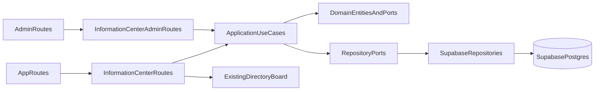

# Plan Centro de Información Backend

## Alcance Aprobado

Se implementará `MVP 1 + MVP 2` del documento `[docs/Refinamientos/Refinamiento Historias y Casos de Usos.docx](docs/Refinamientos/Refinamiento%20Historias%20y%20Casos%20de%20Usos.docx)`:

- `MVP 1`: Cartelera oficial, detalle de anuncio, adjunto, fijado, vencimiento, lectura idempotente, reacción tipo “Entendido” y métricas básicas.
- `MVP 2`: Reglas de residencia, Junta y Servicios recomendados.
- Fuera de esta implementación: notificaciones push, segmentación propietarios/inquilinos, historial avanzado de cambios, reviews abiertas de proveedores, búsqueda global y auditoría avanzada.

## Decisión Arquitectónica

Crear un módulo nuevo `[src/modules/information-center](src/modules/information-center)` para el bounded context del Centro de Información. El módulo seguirá la estructura del proyecto:

- `domain/entities`: entidades con props en `snake_case`.
- `domain/repository.ts`: interfaces de repositorio.
- `application/use-cases`: casos de uso con DTOs en `camelCase` solo si se introducen DTOs nuevos; para consistencia con módulos recientes, las entidades/repositorios mantendrán `snake_case`.
- `infrastructure/repositories`: adaptadores Supabase.
- `infrastructure/services`: servicio de adjuntos si se requiere bucket privado o URLs firmadas.
- `presentation`: rutas Elysia, schemas TypeBox, serializers y mapeo HTTP.

No se debe crear una tabla nueva `board_members` tal como aparece en el documento sin revisar el modelo actual. El proyecto ya usa `building_members`, `profiles`, `users` y la vista `board_members_directory`, expuesta por `[src/modules/directory/presentation/routes.ts](src/modules/directory/presentation/routes.ts)`. Para “Junta”, el plan es reutilizar ese módulo y solo ampliarlo si faltan campos institucionales como período, cargo visible u horario de atención.

## Modelo de Datos Propuesto

Crear migraciones en `[supabase/migrations](supabase/migrations)` para:

- `billboard_announcements`: `building_id`, `author_id`, `title`, `content`, `category`, `attachment_path`, `is_pinned`, `expires_at`, `deleted_at`, timestamps.
- `announcement_reads`: `announcement_id`, `user_id`, `read_at`, `source`; constraint único `(announcement_id, user_id)` para idempotencia.
- `announcement_reactions`: `announcement_id`, `user_id`, `reaction_type`, `created_at`; primary key `(announcement_id, user_id)` para toggle.
- `residence_rule_categories`: categorías por edificio, orden, estado activo.
- `residence_rules`: reglas por edificio, categoría opcional, contenido, adjunto, publicación y orden.
- `recommended_services`: proveedores por edificio, categoría, contacto, disponibilidad, estado activo y recomendado.

Agregar índices por `building_id`, `deleted_at`, `is_pinned`, `expires_at`, `created_at` y claves únicas donde aplique. Activar RLS con las funciones existentes de edificios por rol/residente, siguiendo el patrón de `[supabase/migrations/20260423000200_decisions_rls.sql](supabase/migrations/20260423000200_decisions_rls.sql)`.

## Endpoints Refinados

Montar rutas de residentes en `[src/presentation/app-routes.ts](src/presentation/app-routes.ts)` bajo `/api/v1/app/information-center` y rutas administrativas en `[src/presentation/admin-routes.ts](src/presentation/admin-routes.ts)` bajo `/api/v1/admin/information-center`.

Residentes:

- `GET /announcements`: lista anuncios activos del edificio del usuario, con filtros `category`, `search`, `is_pinned`, `read_status`, paginación.
- `GET /announcements/:id`: detalle y registro automático de lectura.
- `POST /announcements/:id/read`: marca lectura idempotente.
- `POST /announcements/:id/reaction`: toggle de “Entendido” y marca lectura si aún no existe.
- `GET /rules/categories`: categorías activas.
- `GET /rules`: reglas publicadas.
- `GET /rules/:id`: detalle de regla publicada.
- `GET /board`: reutiliza o delega a `directoryRoutes` para miembros de junta.
- `GET /recommended-services`: proveedores activos recomendados.
- `GET /recommended-services/:id`: detalle de proveedor activo.

Administración/Junta:

- `POST /announcements`, `PATCH /announcements/:id`, `DELETE /announcements/:id` con soft delete.
- `GET /announcements/:id/metrics` y `GET /announcements/:id/readers`.
- CRUD de categorías de reglas.
- CRUD de reglas, con publicación/despublicación.
- CRUD de servicios recomendados, usando desactivación lógica.
- Para Junta: mantener alta de miembros en `[src/modules/users/presentation/routes.ts](src/modules/users/presentation/routes.ts)` y lectura en `[src/modules/directory](src/modules/directory)`; si se requieren campos institucionales adicionales, agregar una migración incremental sobre el modelo actual.

## Reglas de Negocio

- Todo recurso debe pertenecer a un `building_id`.
- Admin puede operar sobre cualquier edificio; Junta solo sobre edificios presentes en `profile.boardBuildingIds`, usando `[src/core/presentation/guards.ts](src/core/presentation/guards.ts)`.
- Residente solo puede leer recursos publicados/activos de su edificio.
- Los anuncios vencidos o con `deleted_at` no aparecen en listados activos.
- Los anuncios fijados se ordenan primero y luego por `created_at DESC`.
- La lectura es única por usuario y anuncio.
- La reacción “Entendido” es toggle y crea lectura si no existía.
- Los adjuntos se guardarán como `attachment_path`; la API debe devolver URL firmada si el bucket es privado.
- Reglas solo visibles si están publicadas y activas.*
- Servicios solo visibles si están activos.

## Implementación Por Fases

Fase 1: base técnica y migraciones. Crear tablas, índices, RLS y entidades de dominio para anuncios, lecturas, reacciones, reglas y servicios.

Fase 2: Cartelera. Implementar repositorios, casos de uso y rutas para crear, editar, eliminar, listar, detalle, lectura, reacción y métricas básicas.

Fase 3: Reglas y servicios. Implementar categorías, reglas publicadas/admin y servicios recomendados.

Fase 4: Junta e integración. Reutilizar `directoryRoutes` para app; definir si se amplía el modelo institucional de junta sin duplicar `board_members_directory`.

Fase 5: pruebas y validación. Cubrir casos de uso críticos con `bun:test`, mocks de repositorio, pruebas de multi-tenant, permisos, lectura idempotente y toggle de reacción.

## Archivos Principales A Crear O Modificar

- Crear `[src/modules/information-center](src/modules/information-center)` con capas `domain`, `application`, `infrastructure` y `presentation`.
- Modificar `[src/presentation/app-routes.ts](src/presentation/app-routes.ts)` para montar rutas de residentes.
- Modificar `[src/presentation/admin-routes.ts](src/presentation/admin-routes.ts)` para montar rutas admin/junta.
- Crear migraciones en `[supabase/migrations](supabase/migrations)` para tablas, índices, triggers y RLS.
- Posible ampliación de `[src/modules/directory](src/modules/directory)` o `[src/modules/users](src/modules/users)` solo si Junta requiere campos institucionales no existentes.
- Crear tests en `[tests/modules/information-center](tests/modules/information-center)`.

## Validación

- Ejecutar `bun test` o suites enfocadas de `tests/modules/information-center`.
- Revisar lints/diagnósticos de archivos editados.
- Probar manualmente flujos principales con token residente, token board y token admin.
- Verificar que un residente del Edificio A no pueda consultar recursos del Edificio B.
- Verificar que métricas de anuncios no se pierdan tras soft delete.

